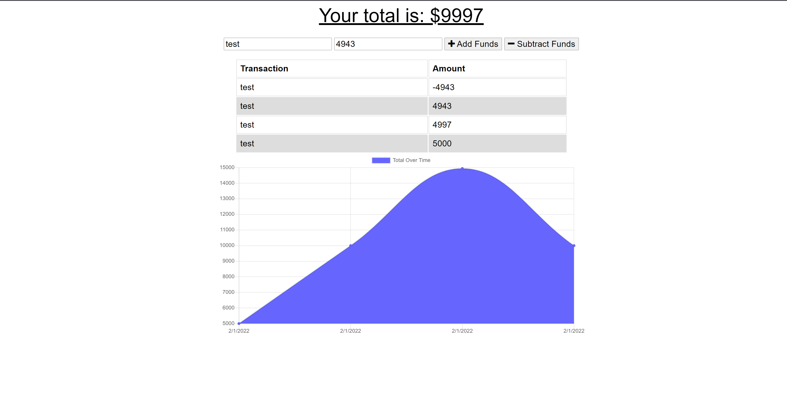

# Budget Tracker

## Table of contents
* [Heroku Link](https://budgettracker-chal19.herokuapp.com/)
* [General info](#general-info)
* [Technologies](#technologies)
* [Installation](#installation)
* [Useful Links](#useful-links)

## General info
This is anapplication that helps users track and manage their money. With this web app, both account withdrawals and deposits can be tracked at all times. Because this applcation is deployed via Heroku, users have acces to to their financial information while offline.
	
## Technologies
Project is created with (all through VScode extension):
* HTML
* CSS
* JavaScript
* Express Js
* Mongoose
	
## Installation

Installation is fairly simple. All you have to do is clone the repository and run npm install in the terminal to download all the dependencies. This application requires the use of the npm packages: compression, mongoose, express, and morgan. After installing all the dependencies, run 'npm start in the termianl to run the application.

## Useful Links
Github link to the original starter code: https://github.com/coding-boot-camp/symmetrical-bassoon.git
